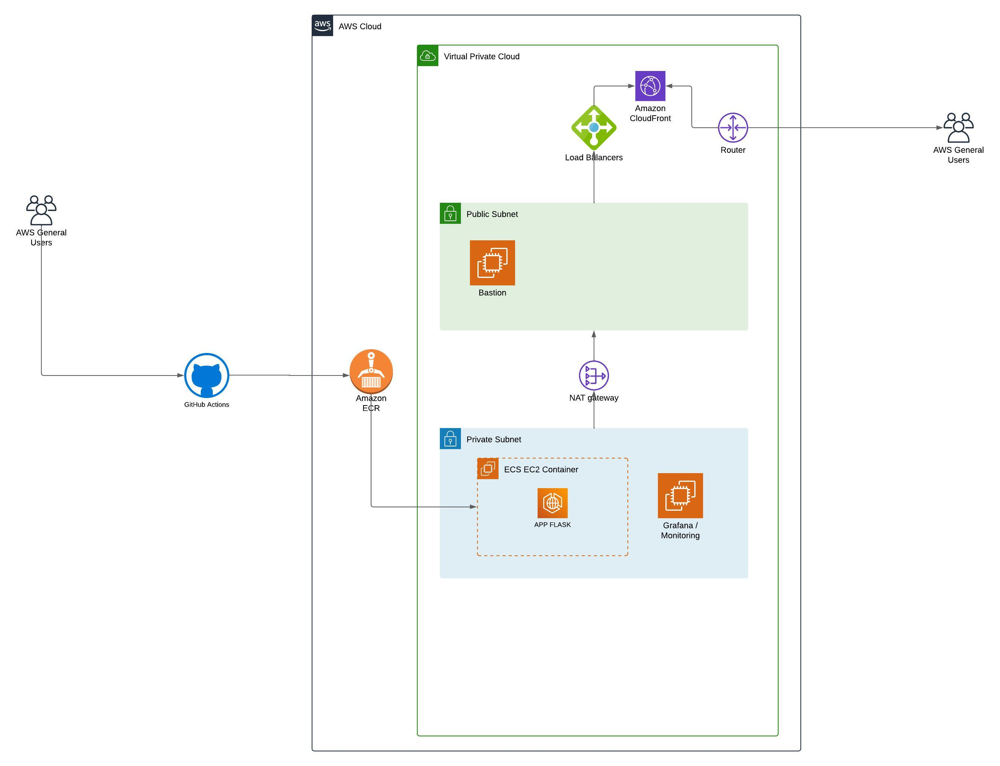

# Registro de Atividades e Decisões

## Testes Executados

1. **Testes de Integração Inicial:** Foram realizados testes de integração para garantir a comunicação adequada entre os diferentes componentes da aplicação, incluindo o GitHub Actions, ECR, ECS EC2, e o load balancer.

2. **Testes de Implantação Automatizada:** Implementei testes para validar a implantação automatizada utilizando o GitHub Actions para garantir consistência e confiabilidade no processo de entrega contínua.

3. **Testes de Escalabilidade:** Executei testes para avaliar a capacidade de escalabilidade da aplicação, observando o comportamento do ECS EC2 e do load balancer ao lidar com aumentos de carga.

## Ideias para Implementação Futura

1. **Implementação de Autoescalonamento:** Gostaria de implementar um mecanismo de autoescalonamento para permitir que a aplicação se ajuste dinamicamente à carga de trabalho, otimizando o uso dos recursos disponíveis.

2. **Integração de Notificações:** Considero a implementação de um sistema de notificações para alertar a equipe em casos de falhas críticas ou eventos importantes.

## Decisões Tomadas e Justificativas

1. **Escolha da AWS para Hospedagem:** Optei por utilizar serviços da AWS, como ECR, ECS EC2 e o load balancer, devido à sua escalabilidade, confiabilidade e integração eficiente.

2. **GitHub Actions para CI/CD:** Escolhi o GitHub Actions para automação do processo de integração contínua e entrega contínua devido à sua integração nativa com o repositório e flexibilidade.

3. **Utilização do Grafana para Monitoria:** Integrei o Grafana para monitoramento da aplicação, permitindo uma visão abrangente do desempenho e saúde do sistema.

## Arquiteturas Testadas e Modificações Realizadas

1. **Arquitetura Inicial com ECS EC2:** Inicialmente, utilizei ECS EC2 para hospedar a aplicação. Após análises de desempenho, decidi realizar a migração para ECS Fargate devido à sua simplicidade e gerenciamento de recursos mais eficiente.

2. **Adoção do Load Balancer:** Integrei um load balancer para distribuir uniformemente o tráfego entre os contêineres, melhorando a disponibilidade e a confiabilidade da aplicação.

3. **Aprimoramentos na Configuração do Grafana:** Realizei ajustes na configuração do Grafana para fornecer métricas mais detalhadas e personalizadas, facilitando a identificação de possíveis problemas.

Este arquivo COMMENTS.md registra todas as atividades, testes, decisões e ideias relacionadas ao desenvolvimento e operação da aplicação. Ele serve como uma documentação valiosa para a equipe, facilitando a compreensão do histórico e aprimoramento contínuo do sistema.

